# Phase 3 report: does the vault make money from spreads with zero incentives?

**VERDICT: UNPROFITABLE** for the design as specified (ADR-001 Option D: keeper-posted quotes, immediate fills). On the 2026-09-04 to 2026-10-03 hold-out (an independent restart), with the best parameters the search found, expected net edge is **−$88/day** against a block-by-block latency sniper with a 1 s information lead and +$1/day under the specification's pessimistic flow (50% informed arrivals, 2 s latency, half the noise volume); drawdown 50.9% of NAV and 10 of 30 days with the circuit breaker tripped under the sniper. *Conditional on:* a trader whose price leads the vault's by 1 s or more, and Binance prices being predictive of what Chainlink Data Streams will show; neither is measured (no Data Streams key).

**With the proposed design change (forward-priced execution: an order placed in block *b* is executed at block *b+5*, 2 s later, once, against a book repriced from the canonical report of that block): PROFITABLE UNDER PESSIMISTIC ASSUMPTIONS on the hold-out by the rule in section 2.4, but only on that window.** Hold-out expected net edge +$49.6/day (pessimistic) and +$215.0/day (sniper); hold-out realized net P&L +$1,175 / +$6,817 (the sniper figure includes $1,974 donated by the sniper's own losing orders), and the 95% block-bootstrap CIs of realized P&L *excluding* those gains are [+$247, +$2,174] / [+$1,732, +$9,340] on a $5,000 vault. **Across windows the same rule gives training (60 days): MARGINAL (pessimistic) / PROFITABLE (sniper); hold-out: PROFITABLE (pessimistic) / PROFITABLE (sniper); all 90 days: PROFITABLE (pessimistic) / PROFITABLE (sniper)** (table in section 3.2), and over all 90 days realized P&L is only about 56% of the expected edge. **Both verdict scenarios are safe for this design by construction:** the pessimistic scenario's 2 s latency equals the 2 s delay, so informed flow has no edge there and that scenario tests only noise volume and tolerance, and the 1 s sniper is below the delay. **It is not robust:** at a 2 s lead (zero margin) the vault still earns +$206.3/day, but at a 3 s lead it makes −$145.3/day, and if execution timing is *not* forced (a sniper that picks its block) it makes −$108.0/day even at a 1 s lead (section 4; those rows use a 15-day sample, every 6th day of the 90, and are partly in-sample).


## Summary

- **What was run.** 91 days of 1-second Binance BTC and ETH prices (2026-07-06 to 2026-10-03; 90 evaluation days plus one volatility warm-up day), the production round rules (strike at the open, UP iff end ≥ strike, ties UP), 15-minute and 1-hour rounds, the **same `generateQuotes` code the keeper will run**, re-quoted every 400 ms block. Search on the first 60 days; the last 30 days were never seen by the search.
- **The fair-value model is sound in the middle and over-confident in the tails.** On 90 days of real rounds, rounds the model puts below 10% happen 4.3% of the time against 2.6% predicted (BTC and ETH 15m, averaged over horizons); above 90%, 96.2% against 97.5%. The strategy therefore carries a volatility multiplier, set from calibration on the **training window only** (pooled log-loss optimum 1.1; not searched, because the expected-edge objective cannot see model error). With it, the same tails are 3.7% observed vs 2.8% predicted below 10% and 96.8% vs 97.3% above 90%. A tail error of several points of probability is the same size as the spreads, so it matters, and a gap remains at the launch multiplier in BTC (see the table in section 1); the check on the whole strategy is the outcome residual (section 3.3).
- **Latency, not spread, decides viability.** Against a bot that sees the price one 1-second bar earlier than the vault and checks the book on every block, the as-specified vault loses $101/day to adverse selection on the hold-out. The vault is quoting 88% of the time and the breaker tripped on 10 of 30 hold-out days, yet spread income is only $16/day against that loss. Of the 145 parameter sets screened for this design, 0 had a positive expected edge under the sniper (best −$106.6/day); wider spreads cannot cover a one-second gap on a 15-minute digital (see section 4).
- **Forward pricing neutralises the sniper.** Filling an order two seconds after it is placed, against a book repriced from newer data, removes the information edge of any trader whose lead is shorter than the delay. The heatmap of delay vs lead (H4) shows the boundary.
- **Earnings are limited by taker flow, not by TVL.** On the hold-out, if retail takers offer the pessimistic $12,000/day of volume, the proposed $5,000 vault's expected edge is +$49.6/day (362% APY); at $2,400/day it is +$6.9/day (51% APY). Return per dollar falls as TVL grows (TVL table). **The volume is an assumption (no users yet)**, so the break-even offered volume is reported instead of a headline APY.
- **Variance is the real risk.** Outcome luck has zero mean but its standard deviation is $118/day against an expected edge of $49.6/day, so a 30-day window can look good or bad by chance (the CIs above).

## How to reproduce

```bash
pnpm install
pnpm --filter @converge/backtest backtest:data   # download and verify the Binance archives (about 370 MB)
pnpm backtest                                    # regenerates this report, results.json, charts and config/strategy.default.json
```

Seeds are fixed; running `pnpm backtest` twice produces byte-identical `results.json` (CI check: `make check-3`). Data pinned by manifest SHA-256 `46e8307e4228bf063e6397b09c304984f6b2da616db3b6e3e378a89f93a2f7ea`.

## 1. Data

| Asset | Source | Resolution | Days | Samples | Missing | Price range | Realized vol (annualized) |
| --- | --- | --- | --- | --- | --- | --- | --- |
| BTC/USD | Binance spot BTCUSDT 1s klines | 1 s | 91 | 7,862,401 | 0 | 61322 to 87395 | 28% |
| ETH/USD | Binance spot ETHUSDT 1s klines | 1 s | 91 | 7,862,401 | 0 | 1713.4 to 2807.2 | 41% |
| MON/USD | Binance USDⓈ-M perpetual MONUSDT 1m klines | 60 s | 91 | 131,041 | 0 | 0.019730 to 0.035840 | 115% |

- **Source and license.** Binance Data Collection, public daily kline archives at https://data.binance.vision (no key). Every archive was verified against the SHA-256 that Binance publishes next to it, and the hashes are pinned in `backtest/data/manifest.json`. The data are public and free to download under Binance's terms (https://www.binance.com/en/terms); only derived close prices are used, and the raw archives are git-ignored.
- **Timing convention.** A bar's close is the price *at the bar's end*, so `px[k]` only contains information available at time k. Strike = the bar at the boundary second; resolution = the bar at the end second; ties resolve UP. Missing seconds (BTC/USD: 0, ETH/USD: 0, MON/USD: 0) are forward-filled.
- **BTC and ETH only.** They use 1-second spot data. **MON is excluded from the economic backtest:** Binance has no MON spot market, so the only history is the USDⓈ-M perpetual at 1-minute resolution (shown above), which cannot support latency or informed-flow modelling at a 400 ms block time, and MON resolves through a Chainlink push-feed round proof (ADR-002) that has no relation to Binance perpetual prints. Its volatility is reported for context only.
- **Chainlink Data Streams history was not used** (it needs an API key and secret we do not have; blocker in `docs/EXTERNAL.md`). Binance is a proxy. The Chainlink *push-feed* history on Monad was read to measure the basis and the cadence (next subsection).

### Chainlink push feeds vs Binance (basis and lag)

For each on-chain update of the Chainlink BTC/USD and ETH/USD push feeds on Monad mainnet (2026-07-06 to 2026-10-03; read round by round through Multicall3, `backtest/data/chainlink-basis.json`), the feed's answer is compared with the Binance price at the same instant and at the lag that best aligns the two.

| Feed | Rounds | Update gap p50 / p95 / max (s) | Basis at lag 0: mean / σ / abs p99 (bps) | Best-aligned lag (s) | Basis at best lag: σ / abs p99 (bps) |
| --- | --- | --- | --- | --- | --- |
| BTC/USD | 155,440 | 30 / 160 / 3609 | -5.44 / 3.86 / 13.6 | 2 | 3.77 / 13.4 |
| ETH/USD | 78,416 | 50 / 334 / 3608 | -5.40 / 4.21 / 14.3 | 2 | 3.89 / 13.5 |

Two readings. (1) **Basis.** The feeds sit a roughly constant 5.4 bps from Binance's USDT-quoted price (consistent with a USDT/USD offset; not verified here), with only about 3.9 bps of jitter around it. If the offset is constant it cancels when the strike and the end price are compared, so using Binance would add only that jitter to outcomes and no systematic bias against the vault. Caveat: the comparison is taken at push-update instants, when the feed is by construction freshly synced, so it describes accuracy at update time, not the error between updates. (2) **Staleness.** Aligning the series by lag barely improves the match (the best lag is 2 s and the error falls by under 1%), so a fixed lag is not resolvable against the basis noise. What limits a push feed is its **update cadence**: BTC updates have a median gap of 30 s and a 95th percentile of 160 s (ETH: 50 s and 334 s). A vault priced from a push feed alone would trail a trader watching Binance by tens of seconds, far more than the 2 s execution delay of the proposed design, so that design needs a low-latency source (Data Streams). **Its Binance-to-Streams lead is exactly what this backtest cannot measure without an API key.**

### Calibration of the fair-probability model

Independent of any trading: the vault's fair probability (EWMA volatility with a 30-minute half-life, `fairProbUp`) against what actually happened, on every real round.

| Asset | Round | Seconds before expiry | Rounds | Mean predicted P(UP) | Observed UP freq. | Brier | Brier of a coin flip |
| --- | --- | --- | --- | --- | --- | --- | --- |
| BTC/USD | 15m | 600 | 8639 | 0.4999 | 0.4991 | 0.1899 | 0.2500 |
| BTC/USD | 15m | 300 | 8639 | 0.4971 | 0.4991 | 0.1329 | 0.2500 |
| BTC/USD | 15m | 120 | 8639 | 0.4968 | 0.4991 | 0.0838 | 0.2500 |
| BTC/USD | 1h | 1800 | 2159 | 0.5083 | 0.5090 | 0.1747 | 0.2500 |
| BTC/USD | 1h | 600 | 2159 | 0.5112 | 0.5090 | 0.0902 | 0.2500 |
| BTC/USD | 1h | 120 | 2159 | 0.5029 | 0.5090 | 0.0402 | 0.2500 |
| ETH/USD | 15m | 600 | 8639 | 0.5021 | 0.5077 | 0.1898 | 0.2500 |
| ETH/USD | 15m | 300 | 8639 | 0.5000 | 0.5077 | 0.1267 | 0.2500 |
| ETH/USD | 15m | 120 | 8639 | 0.5022 | 0.5077 | 0.0760 | 0.2500 |
| ETH/USD | 1h | 1800 | 2159 | 0.5070 | 0.5086 | 0.1663 | 0.2500 |
| ETH/USD | 1h | 600 | 2159 | 0.5136 | 0.5086 | 0.0821 | 0.2500 |
| ETH/USD | 1h | 120 | 2159 | 0.5025 | 0.5086 | 0.0386 | 0.2500 |

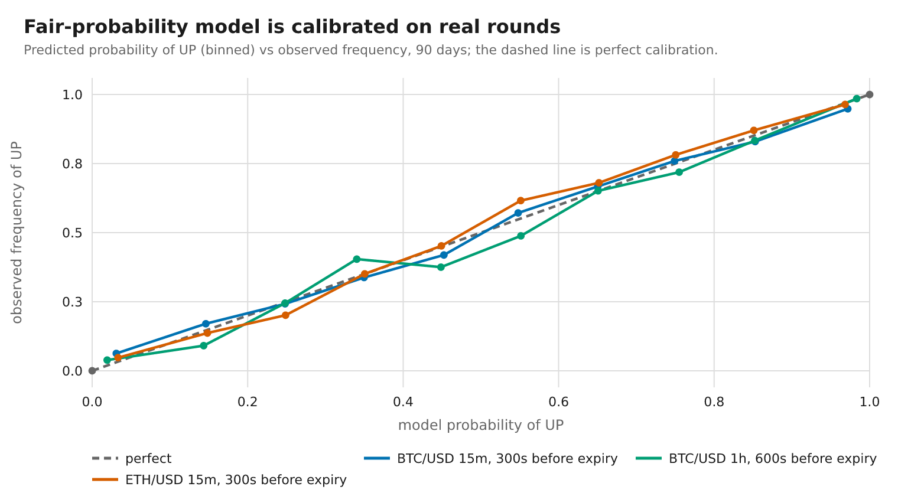

**Tails and the best volatility multiplier.** The means above are about one half for any model, so the informative check is the tails. Rounds the model puts below 10% or above 90%, predicted vs observed, at the default volatility (multiplier 1) and at the launch multiplier; and the multiplier that minimises log loss on these rounds.

| Asset | Round | Seconds left | Below 10%: predicted / observed (n) | Above 90%: predicted / observed (n) | Launch ×1.1: below 10% / above 90% (observed vs predicted) | Log-loss-optimal × |
| --- | --- | --- | --- | --- | --- | --- |
| BTC/USD | 15m | 600 | 5.0% / 9.8% (633) | 95.4% / 92.0% (698) | 9.3% vs 5.2% / 93.2% vs 95.1% | 1.2 |
| BTC/USD | 15m | 300 | 3.1% / 6.3% (1893) | 97.2% / 94.8% (1836) | 5.7% vs 3.4% / 95.4% vs 96.9% | 1.2 |
| BTC/USD | 15m | 120 | 1.7% / 3.1% (2832) | 98.4% / 97.0% (2820) | 2.7% vs 1.9% / 97.5% vs 98.2% | 1.2 |
| BTC/USD | 1h | 1800 | 4.1% / 10.1% (288) | 95.8% / 93.0% (298) | 9.0% vs 4.6% / 94.3% vs 95.6% | 1.3 |
| BTC/USD | 1h | 600 | 1.9% / 3.9% (645) | 98.3% / 98.5% (674) | 3.2% vs 2.0% / 98.4% vs 98.2% | 1.2 |
| BTC/USD | 1h | 120 | 0.7% / 1.3% (891) | 99.3% / 99.2% (894) | 0.9% vs 0.8% / 99.2% vs 99.2% | 1.2 |
| ETH/USD | 15m | 600 | 5.2% / 8.8% (487) | 95.2% / 92.7% (531) | 7.3% vs 5.2% / 92.8% vs 95.0% | 1.05 |
| ETH/USD | 15m | 300 | 3.3% / 4.8% (1663) | 96.8% / 96.4% (1640) | 4.1% vs 3.6% / 96.8% vs 96.6% | 1.05 |
| ETH/USD | 15m | 120 | 1.8% / 1.9% (2633) | 98.2% / 98.2% (2653) | 1.7% vs 2.1% / 98.3% vs 97.9% | 1 |
| ETH/USD | 1h | 1800 | 4.8% / 5.9% (220) | 95.7% / 94.8% (230) | 4.5% vs 5.2% / 96.4% vs 95.3% | 1.05 |
| ETH/USD | 1h | 600 | 2.3% / 2.5% (600) | 97.9% / 98.9% (637) | 2.5% vs 2.6% / 98.8% vs 97.7% | 0.95 |
| ETH/USD | 1h | 120 | 0.9% / 1.1% (880) | 99.4% / 99.8% (869) | 0.9% vs 1.0% / 99.8% vs 99.2% | 1 |

Real prices have fat tails, so a stated 3% happens more often than 3%. The multiplier widens the distribution to compensate; it is one of the searched parameters, and a model-free check on the whole strategy is the **outcome residual** in section 3.3 (zero mean if calibrated; its t-statistic is reported).

## 2. Model and assumptions

Every assumption below is a parameter in `backtest/src/scenarios.ts`; the ones that move the answer most are swept in section 5.

### 2.1 The strategy (`packages/strategy`, shared with the keeper)

- **Fair value:** p = N(d2), d2 = (ln(S/K) − ½σ²τ)/(σ√τ), clamped to [1e-6, 1−1e-6]; EWMA volatility on log returns, time-aware, so 1 s and 1 m sampling annualize identically.
- **Liquidity:** the dynamic pm-AMM schedule L_t = L·√(T−t) (Paradigm, *pm-AMM: A Uniform AMM for Prediction Markets*, Nov 2024, https://www.paradigm.xyz/2024/11/pm-amm, section "Dynamic pm-AMM", subsection "Constant LVR"). Depth of each ladder level is the pm-AMM reserve change L_t·|Φ⁻¹(p₁) − Φ⁻¹(p₀)| over a band of fixed width. The quoted range narrows with √(τ/T) down to a concentration floor.
- **Quotes:** half-spread = max(floor, k·φ(d2)·√(staleness/τ)) + toxicity widening; inventory skew by tanh of net exposure; no-quote window; bounds [0.02, 0.98]; per-market and total at-risk caps; daily drawdown breaker. DOWN is quoted by complement. Property tests assert: never crossed, always inside the bounds, never through fair value, sizes shrink toward expiry, the floor is respected.

### 2.2 The venue and the flow

| Assumption | Value | Why / where it is swept |
| --- | --- | --- |
| Block time | 400 ms | Monad (CLAUDE.md). |
| Rounds | BTC and ETH, 15 m (96/day) and 1 h (24/day) | Wedge product. Rounds open 30 s after the boundary; the strike is the boundary price. |
| Price information | Sample-and-hold 1 s bars. The vault sees the bar from `latencyMs` ago, informed traders the current bar | No interpolation, so nothing uses a bar before it closes. The block grid is offset by 100 ms so bar-edge alignment is unbiased. |
| Posting (as specified) | Takers hit the last *posted* book. The keeper re-posts when the best quote moves ≥ N ticks, after any fill, or after 25-200 blocks; each post costs gas | ADR-001 Option D. Levels that were filled stay empty until the next post. |
| Gas | 100,000 + 20,000 per market per batched update, 102 gwei, MON $0.0343 | ADR-001 estimated 67-107k excluding report verification and on-chain ln/√/Φ and said "realistic 2-3x"; this is about 2-3x. Monad bills the gas limit. |
| Fees | No taker fee, no redeem fee (conservative) | A taker fee only deters informed flow; redeem fee swept (curve in section 5). |
| Noise takers | Poisson arrivals, random side, lognormal size (median $25, σ 1); offered volume $250/h per market (base), $125/h (pessimistic) | **Unknown until we have users; swept over 10 to 1,000 $/h.** |
| Elasticity | Each noise order draws a maximum acceptable cost from an exponential with mean 6% (base) / 4% (pessimistic) of notional and stops walking the book when a level costs more | Without this, flow is inelastic and the best spread is infinite. **An assumption, swept** (tolerance curve). |
| Informed takers (arrivals) | Share of taker arrivals: 20% base, 50% pessimistic. They see the current bar (the vault sees one from `latencyMs` ago, 1000 ms base, 2000 ms pessimistic), compute fair value, and take every level whose net edge exceeds 0.5¢, sized to take the available depth | Matches the specification ("informed traders trade whenever the edge exceeds their threshold"). Swept 0-50% × 100-2000 ms. |
| Informed takers (sniper) | A bot checks the book on every block with the same rule | The adversary that exists wherever a public price feed leads the vault. Not in the specification; **added because it is what a real market contains.** |
| Same-block ordering | Informed orders before noise orders | Worst case for the vault. |
| Vault inputs | Price from `latencyMs` ago; EWMA σ; its own position | Nothing newer than t − latency is used. Verified by a test that rewrites all prices after a cutoff and requires every earlier fill to be identical. |
| Start capital | $5,000 (CLAUDE.md launch TVL cap) | Depth and caps scale with NAV; flow does not (TVL table). |
| Risk limits | Per-market loss ≤ 5% of NAV (default), total ≤ 40%, daily drawdown breaker 5% | CLAUDE.md defaults; the tuned values are in section 6. |

### 2.3 P&L accounting (exact)

Each fill splits into **edge** against the fair value at the instant of the fill and an **outcome residual**: for a vault sale of u shares at price a with fair value p, edge = u(a − p) and residual = u(p − 1{UP}); they sum exactly to the settlement P&L u(a − 1{UP}) (unit-tested to 1e-6). Over many rounds the residual has zero mean if the model is calibrated (the t-statistics in sections 3.2 and 3.3 check this, and they are not all above −2), so the **expected net edge** = spread capture (noise flow) + adverse selection (informed flow) − gas − fees is the quantity the vault earns in expectation. Realized P&L adds the residual, a pure variance term.

**Informed traders' wins are not counted.** If informed flow loses money to the vault (which a rational informed trader would stop doing), that income is *excluded* from the expected edge; their losses *to* informed flow are counted in full (expected edge uses min(0, informed edge) over the window). Realized P&L shows what the simulation actually produced, wins included. In the proposed design this matters: a sniper's limit orders fill only when the market has moved against them, so the raw informed line is positive for the vault, and it is deliberately not credited.

### 2.4 Method and verdict rule

1. The search sees only 2026-07-06 to 2026-09-04 (60 days). 2026-09-04 to 2026-10-03 (30 days) is reported out of sample as an **independent restart** with a fresh $5,000 NAV; only the parameter search and the volatility multiplier's value were restricted to the training window. The scenarios, the proposed design, its 2 s delay and the idea of a multiplier were chosen after seeing training-window results, and the calibration table that motivates the multiplier includes hold-out rounds.
2. **What was and was not fixed in advance.** The pessimistic scenario (the specification's definition) and the verdict rule were set before any hold-out number was read. The **sniper scenario and the forward-priced design were not in the original plan**: they were developed after exploring training-window results, in response to what those showed. Treat the verdict as conditional on the scenarios chosen, not as a pre-registered test.
3. For each design the search draws random parameter sets from a fixed grid (and mutates the best), scores each on the pessimistic and the sniper scenario with *expected net edge − 0.5 × daily standard deviation − penalties for breaker trips and drawdowns above 12%*, then confirms the finalists on all 60 training days. Both designs get the same budget and objective.
4. **Verdict = the worst of two scenarios on the hold-out**: the specification's pessimistic flow, and the sniper with a 1 s lead. Per scenario: expected net edge ≤ 0 → UNPROFITABLE; expected edge > 0 and the 95% **moving-block** bootstrap CIs (5-day blocks, so volatility clustering is respected) of *both* the expected edge and the realized P&L excluding informed gains above 0 → PROFITABLE UNDER PESSIMISTIC ASSUMPTIONS; otherwise MARGINAL. The proposed design's verdict also depends on stress cases (section 4) that the rule does not include and that it fails.

## 3. Results

### 3.1 Scenarios

| Scenario | Noise $/h/market | Cost tolerance | Informed | Latency / lead |
| --- | --- | --- | --- | --- |
| Base | 250 | 6% | 20% of arrivals | 1000 ms |
| Pessimistic (spec) | 125 | 4% | 50% of arrivals | 2000 ms |
| Sniper, 1 s lead | 250 | 6% | sniper (every block) | 1000 ms |
| Sniper, 2 s lead, thin flow | 125 | 4% | sniper (every block) | 2000 ms |

### 3.2 Headline: hold-out window (out of sample, 30 days, independent restart)

| Parameters / design | Scenario | Expected net edge $/day | 95% CI of expected edge ($/day) | Realized net P&L | 95% CI of realized, excl. informed gains | Daily Sharpe (ann.) | Max drawdown (daily, % of starting NAV) | Breaker-trip days | Class |
| --- | --- | --- | --- | --- | --- | --- | --- | --- | --- |
| As specified, CLAUDE.md defaults | Base | +$180.1 | [+$143, +$221] | +$9,639 | [+$2,490, +$16,000] | 9.7 | 23.1% | 8/30 | PROFITABLE |
| As specified, CLAUDE.md defaults | Pessimistic (spec) | −$28.9 | [−$43, −$19] | +$995 | [−$1,761, +$6,537] | 1.6 | 22.3% | 17/30 | UNPROFITABLE |
| As specified, CLAUDE.md defaults | Sniper, 1 s lead | −$84.1 | [−$111, −$51] | −$3,974 | [−$6,620, −$1,485] | -12.5 | 80.7% | 30/30 | UNPROFITABLE |
| As specified, CLAUDE.md defaults | Sniper, 2 s lead, thin flow | −$77.9 | [−$103, −$44] | −$3,891 | [−$6,547, −$891] | -11.1 | 81.0% | 30/30 | UNPROFITABLE |
| As specified, tuned | Base | +$24.1 | [+$23, +$26] | +$618 | [+$343, +$810] | 12.3 | 0.8% | 0/30 | PROFITABLE |
| As specified, tuned | Pessimistic (spec) | +$1.4 | [+$0, +$3] | +$71 | [−$67, +$238] | 3.7 | 0.7% | 0/30 | MARGINAL |
| As specified, tuned | Sniper, 1 s lead | −$87.7 | [−$122, −$57] | −$2,547 | [−$3,600, −$1,096] | -15.8 | 50.9% | 10/30 | UNPROFITABLE |
| As specified, tuned | Sniper, 2 s lead, thin flow | −$97.7 | [−$146, −$59] | −$3,879 | [−$5,065, −$2,580] | -33.5 | 77.6% | 27/30 | UNPROFITABLE |
| Proposed design, CLAUDE.md defaults | Base | +$229.9 | [+$194, +$270] | +$11,722 | [+$6,841, +$16,618] | 11.4 | 16.7% | 7/30 | PROFITABLE |
| Proposed design, CLAUDE.md defaults | Pessimistic (spec) | +$66.8 | [+$61, +$74] | +$1,360 | [−$887, +$4,246] | 2.5 | 17.6% | 8/30 | MARGINAL |
| Proposed design, CLAUDE.md defaults | Sniper, 1 s lead | +$163.0 | [+$128, +$204] | +$28,052 | [−$39,466, +$15,106] | 6.7 | 149.2% | 15/30 | MARGINAL |
| Proposed design, CLAUDE.md defaults | Sniper, 2 s lead, thin flow | +$59.8 | [+$48, +$76] | +$1,481 | [−$107, +$4,541] | 3.0 | 20.0% | 8/30 | MARGINAL |
| Proposed design, tuned (launch parameters) | Base | +$210.8 | [+$208, +$219] | +$6,620 | [+$4,980, +$8,068] | 18.0 | 4.5% | 0/30 | PROFITABLE |
| Proposed design, tuned (launch parameters) | Pessimistic (spec) | +$49.6 | [+$45, +$57] | +$1,175 | [+$247, +$2,174] | 6.4 | 5.1% | 0/30 | PROFITABLE |
| Proposed design, tuned (launch parameters) | Sniper, 1 s lead | +$215.0 | [+$202, +$228] | +$6,817 | [+$1,732, +$9,340] | 16.3 | 8.9% | 0/30 | PROFITABLE |
| Proposed design, tuned (launch parameters) | Sniper, 2 s lead, thin flow | +$47.1 | [+$42, +$51] | +$1,304 | [−$38, +$2,405] | 7.6 | 7.4% | 0/30 | MARGINAL |

Expected edge is what the vault earns on average; realized P&L adds outcome luck. A negative expected edge is a loss whatever the luck. *Realized net P&L* includes whatever informed traders donated to the vault (a sniper's resting orders can fill against it); the CI deliberately excludes those gains, so the realized figure can lie outside its own CI. Drawdown is of the cumulative daily P&L as a share of the starting NAV and can exceed 100% when donations inflate the equity curve. Rows labelled *as specified* use ADR-001 Option D unchanged. All amounts are dollars on a $5,000 vault.

**The same rule on every window** (proposed design, launch parameters, and the specified design's best parameters; the training window is where the parameters were searched, so it is in-sample for the search but not for the verdict question):

| Design / scenario | Window | Days | Expected edge $/day (95% CI) | Realized net P&L $/day | Realized t-stat | Outcome residual t-stat | Class |
| --- | --- | --- | --- | --- | --- | --- | --- |
| Specified / Pessimistic (spec) | training | 60 | +$1.0 [+$1, +$2] | +$1.4 | 0.9 | 0.3 | MARGINAL |
| Specified / Pessimistic (spec) | hold-out | 30 | +$1.4 [+$0, +$3] | +$2.4 | 1.1 | 0.4 | MARGINAL |
| Specified / Pessimistic (spec) | all 90 | 90 | +$1.2 [+$1, +$2] | +$1.8 | 1.3 | 0.5 | MARGINAL |
| Specified / Sniper, 1 s lead | training | 60 | −$67.8 [−$88, −$54] | −$42.8 | -2.5 | 1.4 | UNPROFITABLE |
| Specified / Sniper, 1 s lead | hold-out | 30 | −$87.7 [−$122, −$57] | −$84.9 | -4.5 | 0.1 | UNPROFITABLE |
| Specified / Sniper, 1 s lead | all 90 | 90 | −$59.4 [−$75, −$47] | −$42.7 | -3.6 | 1.3 | UNPROFITABLE |
| Proposed / Pessimistic (spec) | training | 60 | +$46.7 [+$43, +$50] | +$23.0 | 1.4 | -1.5 | MARGINAL |
| Proposed / Pessimistic (spec) | hold-out | 30 | +$49.6 [+$45, +$57] | +$39.2 | 1.8 | -0.5 | PROFITABLE |
| Proposed / Pessimistic (spec) | all 90 | 90 | +$48.5 [+$45, +$52] | +$27.3 | 2.0 | -1.6 | PROFITABLE |
| Proposed / Sniper, 1 s lead | training | 60 | +$243.0 [+$233, +$257] | +$304.7 | 6.7 | -0.5 | PROFITABLE |
| Proposed / Sniper, 1 s lead | hold-out | 30 | +$215.0 [+$202, +$228] | +$227.2 | 4.7 | -1.1 | PROFITABLE |
| Proposed / Sniper, 1 s lead | all 90 | 90 | +$250.1 [+$241, +$261] | +$350.9 | 7.1 | -0.5 | PROFITABLE |

Realized net P&L is about half of the expected edge over the full 90 days for the proposed design, and the residual t-statistic is below −2 in some training-window cells (the same alarm threshold as above): the outcome residual is a real, partly unexplained drag, not zero-mean noise, and the expected edge probably overstates what a live vault would earn. The hold-out window is the most favourable of the three.

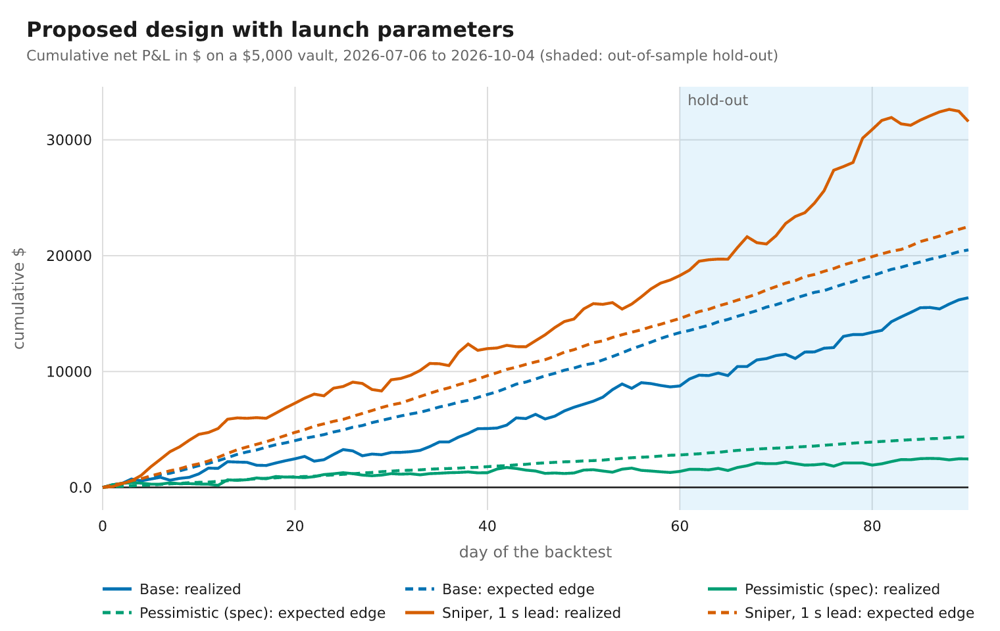

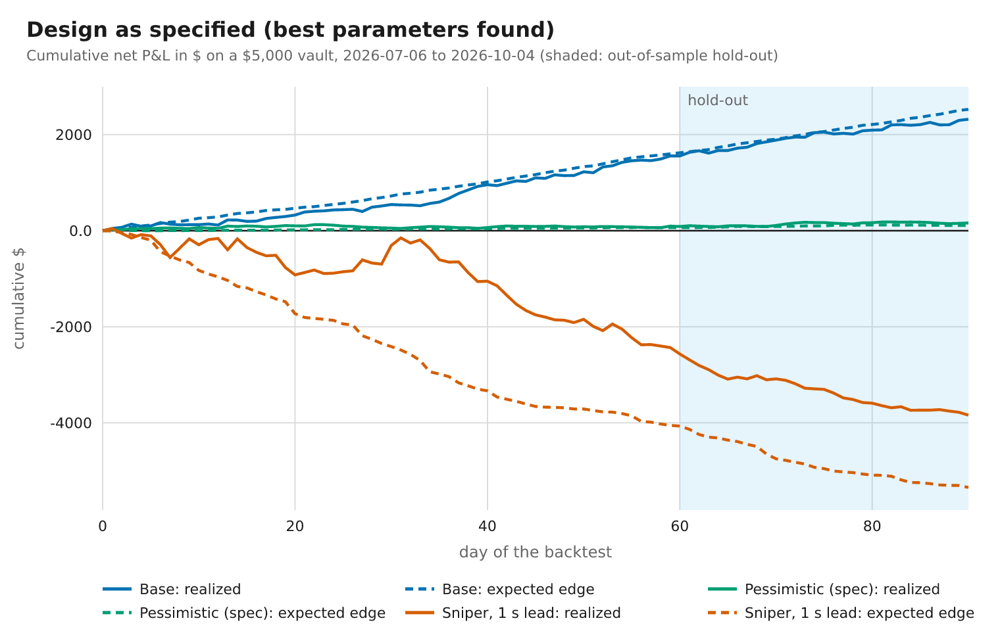

### 3.3 Decomposition and risk (hold-out)

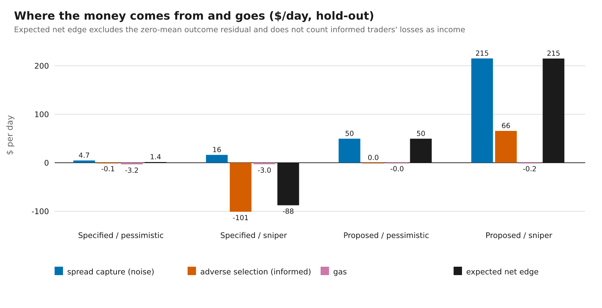

| Run | Spread capture $/day | Adverse selection $/day | Gas $/day | Outcome residual $/day (t-stat) | σ of daily P&L | Quote uptime | Inventory at expiry mean / p95 (shares) | Peak at-risk (% NAV) |
| --- | --- | --- | --- | --- | --- | --- | --- | --- |
| Proposed / Base | +$211.0 | +$0.0 | −$0.1 | +$10 (t = 0.2) | $234 | 99% | 14 / 86 | 3.1% |
| Proposed / Pessimistic (spec) | +$49.7 | +$0.0 | −$0.0 | −$10 (t = -0.5) | $118 | 100% | 4 / 29 | 2.0% |
| Proposed / Sniper, 1 s lead | +$215.1 | +$65.8 | −$0.2 | −$54 (t = -1.1) | $267 | 100% | 21 / 115 | 3.3% |
| Specified / Pessimistic (spec) | +$4.7 | −$0.1 | −$3.2 | +$1 (t = 0.4) | $12 | 100% | 0 / 0 | 0.3% |
| Specified / Sniper, 1 s lead | +$16.3 | −$101.0 | −$3.0 | +$3 (t = 0.1) | $103 | 88% | 6 / 34 | 4.1% |

Quote uptime and inventory are over all 90 days of the run. The outcome residual should have zero mean if the fair-value model is calibrated, so it is the model-free check on the whole strategy: a t-statistic well below −2 would mean the expected edge is overstated. It is also the reason a short window can disagree with the expected edge.

### 3.4 P&L by market (proposed, pessimistic, all 90 days)

| Market | Rounds | Net P&L | Spread capture | Adverse selection | Outcome residual |
| --- | --- | --- | --- | --- | --- |
| BTC/USD 15m | 8640 | −$218 | +$1,040 | +$0 | −$1,258 |
| ETH/USD 15m | 8640 | −$338 | +$941 | +$0 | −$1,279 |
| BTC/USD 1h | 2160 | +$1,022 | +$1,085 | +$0 | −$63 |
| ETH/USD 1h | 2160 | +$1,991 | +$1,302 | +$0 | +$689 |

Outcome residual over all 90 days, proposed design: pessimistic −$21.2/day (t = -1.6), base −$45.9/day (t = -1.6). A t-statistic below −2 would indicate that the model flatters the expected edge; the 15-minute markets' residuals above are the ones to watch.

Over all 90 days the proposed design earns +$48.5/day expected edge in the pessimistic scenario and +$227.7/day in the base scenario (hold-out alone: +$49.6 and +$210.8).

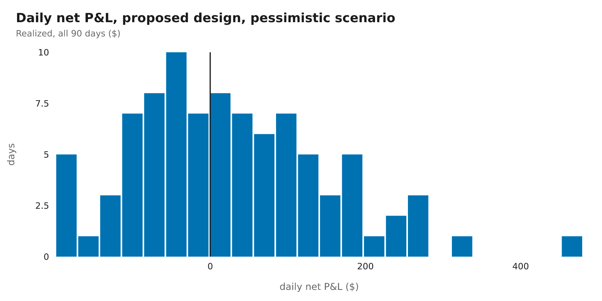

## 4. The pessimistic case and the design changes

The pessimistic flow of the specification (50% informed arrivals, 2 s latency, half the noise volume) is only just survivable by the as-specified design, with small, slow, wide quotes (expected +$1.4/day on the hold-out: effectively break-even). What kills it is the sniper. The table evaluates each candidate fix on the same sample of 15 days (every 6th day of the 90) (a descriptive comparison, not a selection).

| Design | Pessimistic $/day | Class | Sniper $/day | Class | Sniper breaker-trip days | Sniper quote uptime |
| --- | --- | --- | --- | --- | --- | --- |
| As specified, CLAUDE.md defaults | −$38.0 | UNPROFITABLE | −$134.4 | UNPROFITABLE | 15/15 | 0% |
| As specified, tuned parameters | +$0.7 | MARGINAL | −$103.4 | UNPROFITABLE | 2/15 | 96% |
| + much wider floor (half-spread ≥ 10¢, 5x staleness term) | +$0.4 | MARGINAL | −$97.1 | UNPROFITABLE | 0/15 | 100% |
| + 1h markets only | +$0.5 | MARGINAL | −$19.7 | UNPROFITABLE | 0/15 | 100% |
| + quote only mid-round (no quotes in the last 600 s) | +$0.7 | MARGINAL | −$103.4 | UNPROFITABLE | 2/15 | 96% |
| + 1% taker fee paid to LPs | +$0.3 | MARGINAL | −$93.2 | UNPROFITABLE | 1/15 | 97% |
| + tiny depth (pm-AMM L = 1% of NAV, per-market cap 0.5%) | −$1.7 | UNPROFITABLE | −$36.5 | UNPROFITABLE | 0/15 | 97% |
| Swap-time pricing, immediate fills | +$29.7 | MARGINAL | −$112.5 | UNPROFITABLE | 15/15 | 3% |
| + forward-priced execution, 2 blocks (0.8 s) | +$36.0 | MARGINAL | −$107.5 | UNPROFITABLE | 15/15 | 6% |
| + forward-priced execution, 5 blocks (2.0 s) | +$41.5 | MARGINAL | +$210.3 | PROFITABLE | 0/15 | 100% |

*Note:* the as-specified tuned parameters already include a half-spread floor of 0.1 and a 600 s no-quote window, so the rows that add those are the baseline repeated (or nearly so), not independent evidence. The claim that parameter-level changes do not fix the sniper result rests mainly on the search itself: 145 parameter sets screened, 0 with a positive expected edge under the sniper.

- **Wider floors, 1h-only, mid-round-only quoting, an LP-side taker fee and tiny depth do not fix it**: none of these 5 changes makes the sniper result positive (−$97, −$20, −$103, −$93, −$37 $/day). They change how much the vault loses, or how fast the circuit breaker stops it, but not the sign. The reason is arithmetic: the fair probability of a digital moves `φ(d2)/√τ` per √second of price movement, independent of volatility: at the money that is 1.6¢ at 600 s, 2.3¢ at 300 s, 3.6¢ at 120 s before expiry per one-second standard deviation, so a one-second information gap makes a stale quote wrong by several cents on most blocks, while retail takers accept half-spreads of only a few cents.
- **Forward-priced execution**: Swap-time pricing, immediate fills gives −$112/day against the sniper; + forward-priced execution, 2 blocks (0.8 s) gives −$108/day against the sniper; + forward-priced execution, 5 blocks (2.0 s) gives +$210/day against the sniper. The fill price then uses data newer than the information the taker acted on; a trader's lead is only useful while the book lags it, and once the delay exceeds the lead the book already contains what they knew. The cost is a two-step swap (place, then fill 2 s later) and a contract that prices from an attached oracle report at execution; both are Phase 4 work and are listed under Needs from Nisarg.

### Robustness of the proposed design

The proposed design is profitable against the 1 s sniper only because the sniper's lead is shorter than the 2 s delay. Same launch parameters, base noise volume, sample of 15 days:

| Case | Expected net edge $/day | Informed edge (raw) $/day | Class | Breaker-trip days |
| --- | --- | --- | --- | --- |
| Sniper, 1 s lead (the verdict scenario) | +$210.3 | +$36.6 | PROFITABLE | 0/15 |
| Sniper, 2 s lead (equal to the delay: zero margin) | +$206.3 | +$0.0 | PROFITABLE | 0/15 |
| Sniper, 3 s lead (above the delay) | −$145.3 | −$152.6 | UNPROFITABLE | 15/15 |
| Sniper, 3 s lead, delay 8 blocks (3.2 s) | +$188.7 | +$0.2 | PROFITABLE | 0/15 |
| Timing-option sniper, 1 s lead (execution not forced) | −$108.0 | −$142.7 | UNPROFITABLE | 15/15 |
| Timing-option sniper, 2 s lead (execution not forced) | −$96.7 | −$108.8 | UNPROFITABLE | 15/15 |

- **Zero margin at a 2 s lead.** At lead = delay the sniper's limit orders essentially never fill, so "sniper edge 0" is true by construction, not a measured robustness. A lead above the delay (3 s) breaks it, and the lead is **unmeasured** (no Data Streams key).
- **Execution must be forced.** The simulator executes an order once, at its block, and drops it if it does not fill. If the executor can choose the block or the report (ADR-004 now forbids this: single execution at block *b+n* against the canonical report of that block, no cancellation), a sniper that waits for a favourable moment re-creates the lead and the design loses (the *timing-option* rows).
- **Griefing and gas.** A sniper placing an order on every block costs the vault's executor gas for each execution. In the sniper scenario 27,610 informed orders were placed over 15 days (1,841/day); at 400,000 gas each that would be about $3/day if the vault paid. The simulation charges gas only for orders that fill; **the design therefore requires the taker to prepay execution gas with the order** (ADR-004).

## 5. Sensitivity

Each cell is expected net edge in $/day (blue = profit, orange = loss) on a sample of 15 days (every 6th day of the 90).

### H4: execution delay vs sniper information lead (the design boundary)

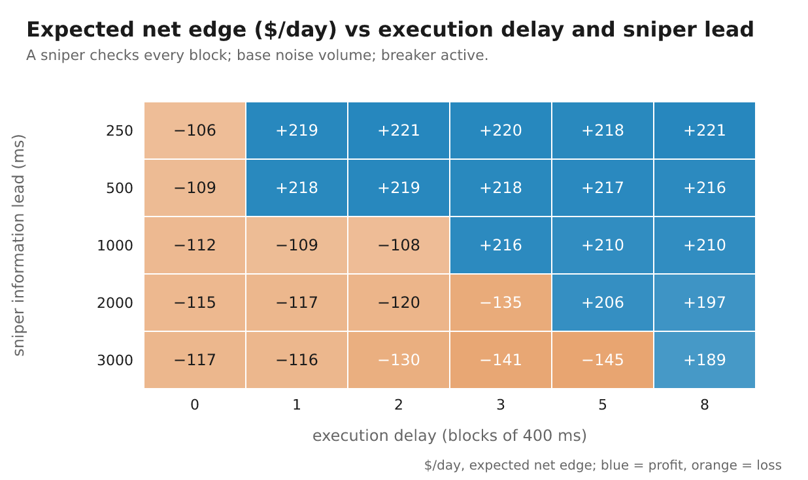

Sufficient delay for the vault to be profitable at every larger delay: 250 ms lead: ≥ 1 block (0.4 s); 500 ms lead: ≥ 1 block (0.4 s); 1000 ms lead: ≥ 3 blocks (1.2 s); 2000 ms lead: ≥ 5 blocks (2.0 s); 3000 ms lead: ≥ 8 blocks (3.2 s).

### H1 and H5: informed share × latency (the specification's axes)

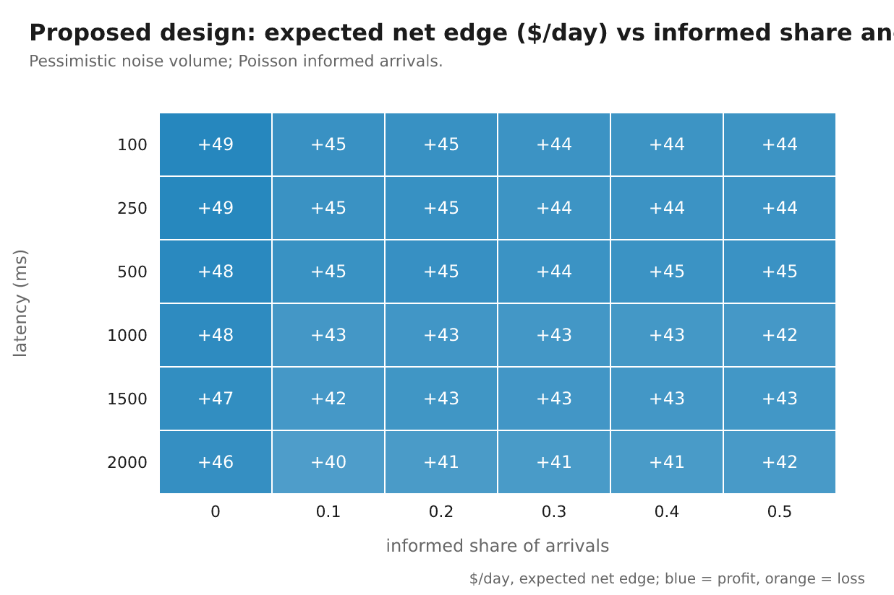

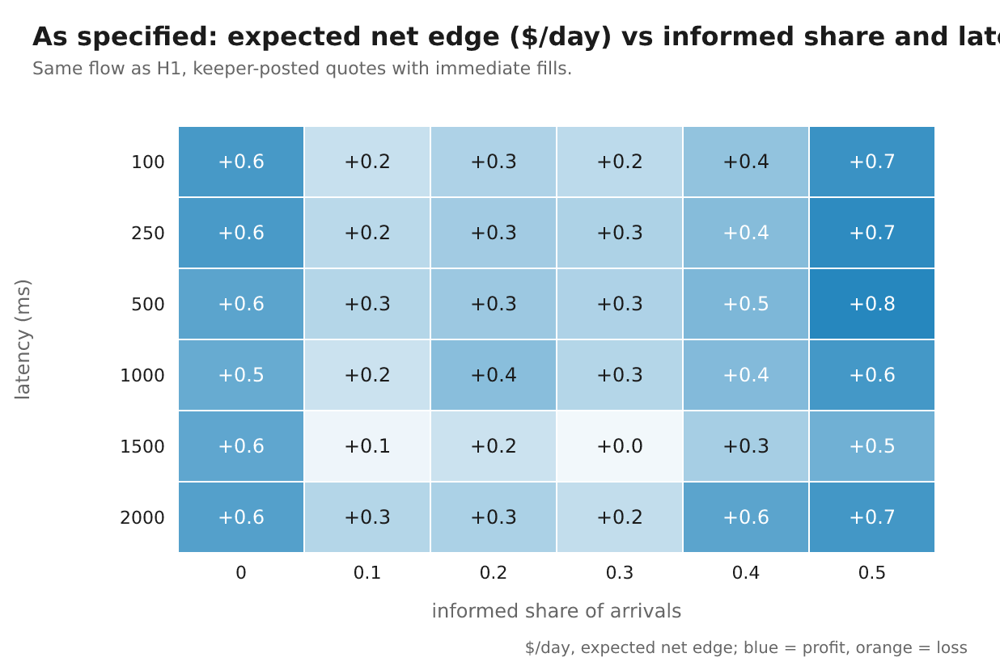

Proposed design: 36 of 36 cells profitable; as specified (its best parameters): 36 of 36. Latencies of 100 ms and below are not resolved by 1-second bars on a 400 ms grid (see Limitations).

### H2: minimum half-spread × no-quote window

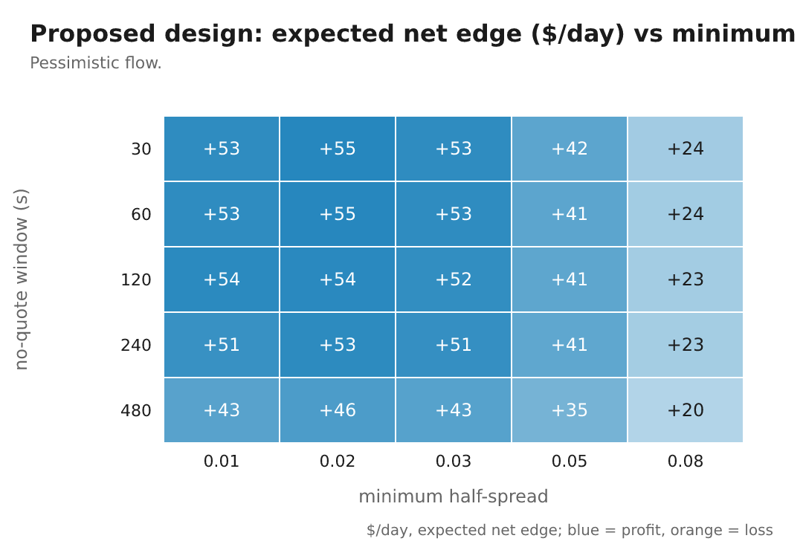

### H3: toxicity threshold × informed share

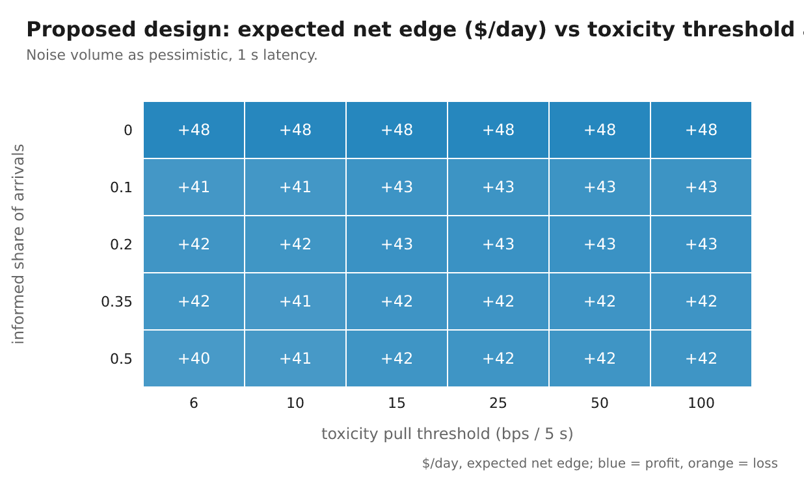

### Noise volume: the break-even

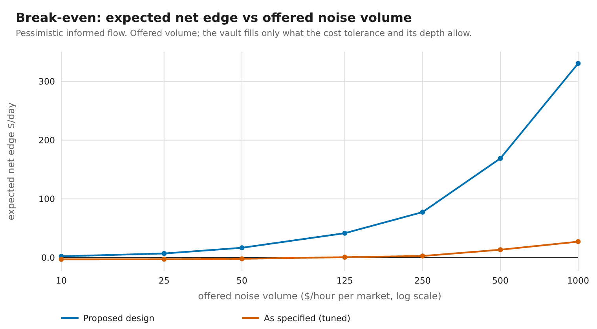

| Offered noise volume ($/h/market) | Offered ($/day, 4 markets) | Filled ($/day) | Expected edge $/day | Net P&L $/day (realized sample) |
| --- | --- | --- | --- | --- |
| 10 | $960 | $41 | +$2.2 | +$5.9 |
| 25 | $2,400 | $114 | +$6.9 | +$1.0 |
| 50 | $4,800 | $255 | +$16.7 | +$21.7 |
| 125 | $12,000 | $691 | +$41.5 | −$18.4 |
| 250 | $24,000 | $1,347 | +$77.4 | +$24.4 |
| 500 | $48,000 | $3,162 | +$168.8 | +$112.9 |
| 1000 | $96,000 | $6,581 | +$330.5 | +$179.4 |

**Proposed design: positive at every tested volume**, down to $10/h per market ($960/day across the four markets); there is no keeper gas to cover (other costs, such as Data Streams verification fees and keeper infrastructure, are not modelled).

**As specified (tuned): break-even at about $101/h per market offered ($9,685/day across the four markets);** below it the keeper's gas exceeds spread income.

### LP return by TVL

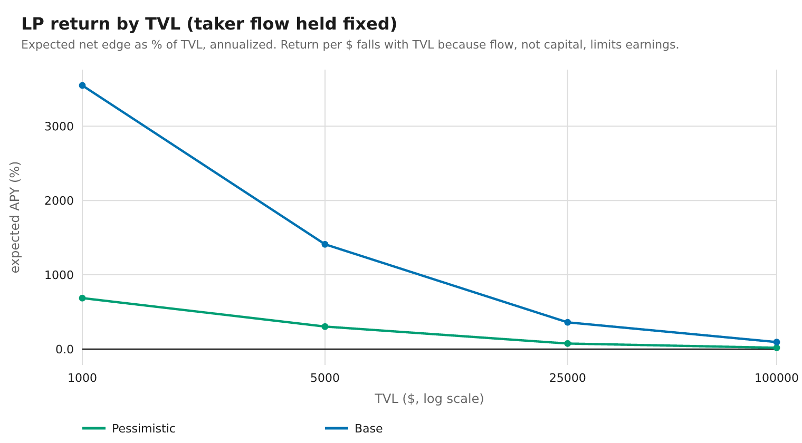

| TVL | Pessimistic: expected edge $/day | Pessimistic: expected APY | Base: expected edge $/day | Base: expected APY |
| --- | --- | --- | --- | --- |
| $1,000 | +$18.8 | 686.7% | +$97.2 | 3548.5% |
| $5,000 | +$41.5 | 303.3% | +$193.2 | 1410.4% |
| $25,000 | +$51.9 | 75.7% | +$247.1 | 360.8% |
| $100,000 | +$49.5 | 18.1% | +$259.2 | 94.6% |

Taker flow is held fixed while TVL grows, so earnings are flow-limited and the return per dollar falls: **APY figures are only meaningful together with the volume assumption**, and a vault much larger than the flow can use earns almost nothing per dollar. Expected APY here ignores the variance in section 3.

### Noise elasticity and redemption fee

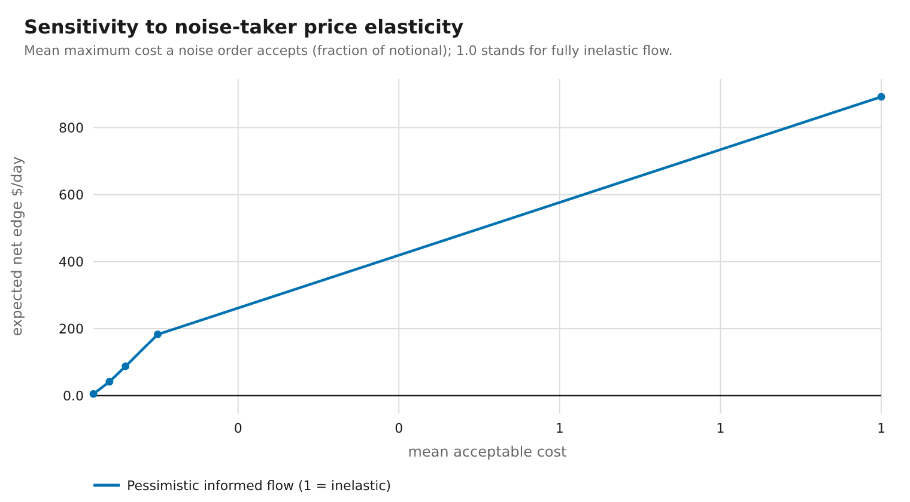

| Mean acceptable cost | Expected edge $/day |
| --- | --- |
| 2% | +$5.0 |
| 4% | +$41.5 |
| 6% | +$87.7 |
| 10% | +$182.7 |
| inelastic | +$891.9 |

| redeemFeeBps | Expected edge $/day |
| --- | --- |
| 0 | +$41.5 |
| 25 | +$41.0 |
| 100 | +$39.2 |

## 6. Launch parameters and rationale

Written to `config/strategy.default.json` for the **forward-priced execution design** (delay 5 blocks), which is **Proposed (ADR-004), not accepted**. For ADR-001 as written (keeper-posted, immediate fills) no parameter set survives the sniper, so no launch configuration is written for it; the best parameters found are the *as specified, tuned* rows in section 3.2 and the search log. The tuned risk caps (per-market 0.01, total 0.08) are tighter than CLAUDE.md's defaults (0.05 and 0.4), which the specification allows (tunable, to be set by the Phase 3 backtest). Chosen by the search on the training window under the pessimistic and the sniper scenarios, then confirmed on the hold-out; candidates were scored on risk-adjusted expected edge, not on the best case.

| Parameter | CLAUDE.md default | Launch value | Role |
| --- | --- | --- | --- |
| `minHalfSpread` | 0.02 | 0.05 | Floor on the half-spread; with the staleness term it sets what a noise taker pays. |
| `maxHalfSpread` | 0.2 | 0.2 | Cap: a wider quote would never be accepted by retail flow. |
| `volSpreadK` | 1 | 1 | Scales the staleness-risk term φ(d2)·√(stalenessSec/τ) that widens quotes where a digital's gamma is large. |
| `stalenessSec` | 1.5 | 4 | How stale the vault assumes its price to be when it is hit (feeds the term above). |
| `inventorySkewMax` | 0.03 | 0.1 | Maximum shift of the quote centre against inventory (always < 0.8 × half-spread, so quotes never cross fair value). |
| `inventorySkewK` | 2 | 2 | tanh steepness: how quickly inventory is leaned against. |
| `toxicityPullBps` | 12 | 12 | Quotes are pulled when the price range over the window exceeds this. |
| `toxicityWindowSec` | 5 | 5 | Window of the toxicity range measure. |
| `toxicityWidenMax` | 0.03 | 0 | Extra half-spread added just below the pull threshold. |
| `noQuoteWindowSec` | 60 | 30 | Final seconds of a round with no quotes: gamma explodes near expiry. |
| `priceMin` | 0.02 | 0.02 | CLAUDE.md quote bound. |
| `priceMax` | 0.98 | 0.98 | CLAUDE.md quote bound. |
| `tick` | 0.01 | 0.01 | 1¢ price grid. |
| `levels` | 3 | 2 | Price levels per side. |
| `baseRangeTicks` | 6 | 8 | Ladder span at round start; narrows with √(τ/T). |
| `minRangeTicks` | 2 | 2 | Concentration floor: the ladder never narrows below this. |
| `liquidityNavFraction` | 0.5 | 0.12 | pm-AMM base liquidity L as a fraction of NAV: the main knob for depth and therefore variance. |
| `minLevelSize` | 1 | 1 | Dust threshold (shares). |
| `perMarketMaxFraction` | 0.05 | 0.01 | Worst-case loss allowed in one market, as a fraction of NAV. |
| `totalAtRiskMaxFraction` | 0.4 | 0.08 | Worst-case loss allowed across all markets. |
| `drawdownBreakerFraction` | 0.05 | 0.05 | Daily NAV drawdown that pauses quoting (never withdrawals). |
| `refreshTicks` | 1 | 2 | Posting rule for the as-specified design only (the proposed design recomputes every block). |
| `maxQuoteAgeBlocks` | 25 | 25 | As above. |

Volatility estimator: half-life 1800 s, prior 0.5, clamp [0.1, 3] (not searched), **scale 1.1** (fat-tail multiplier chosen by pooled log loss on the training window; CLAUDE.md default 1).

### Why these values

The search maximised **expected net edge minus half the daily standard deviation**, with penalties for breaker trips and drawdowns over 12%, jointly under the pessimistic and the sniper scenarios, on the training window only. The result, evaluated on the untouched hold-out:

| Parameters (proposed design) | Scenario | Expected edge $/day | σ of daily P&L | Max drawdown (daily) | Breaker-trip days |
| --- | --- | --- | --- | --- | --- |
| CLAUDE.md defaults | Pessimistic | +$66.8 | $340 | 17.6% | 8/30 |
| Launch parameters | Pessimistic | +$49.6 | $118 | 5.1% | 0/30 |
| Launch parameters | Sniper, 1 s lead | +$215.0 | $267 | 8.9% | 0/30 |

**Depth and per-market cap (H6)** are the variance controls. Each cell: expected edge $/day / σ of daily P&L $ / breaker-trip days on the sample.

| per-market cap \ L (fraction of NAV) | 0.03 | 0.06 | 0.12 | 0.25 | 0.5 |
| --- | --- | --- | --- | --- | --- |
| 0.01 | +$23 / $40 / 0 | +$33 / $58 / 0 | **+$42 / $65 / 0** | +$44 / $69 / 0 | +$45 / $70 / 0 |
| 0.02 | +$23 / $41 / 0 | +$34 / $64 / 0 | +$42 / $69 / 0 | +$48 / $74 / 0 | +$50 / $79 / 1 |
| 0.035 | +$23 / $42 / 0 | +$34 / $66 / 0 | +$42 / $79 / 0 | +$48 / $79 / 0 | +$51 / $104 / 2 |
| 0.05 | +$23 / $43 / 0 | +$34 / $67 / 0 | +$42 / $82 / 0 | +$48 / $85 / 0 | +$49 / $98 / 2 |

The launch values (L = 0.12, per-market cap = 0.01; bold) give +$41.5/day with σ $65 and 0/15 breaker-trip days. The deepest cell of the grid (L = 0.5, cap = 0.05) gives +$48.5/day (+17% vs launch), σ $98 (1.5x) and 2/15 trip days. CLAUDE.md's defaults (L = 0.5, cap = 0.05) are that corner.

**Spread floor and no-quote window (H2).** At a 30 s no-quote window the expected edge across half-spread floors 0.01, 0.02, 0.03, 0.05, 0.08 is +$52.9, +$55.1, +$53.0, +$41.5, +$23.7 $/day; the launch floor is 0.05 and the window 30 s. The best floor in that row is 0.02. The search objective also weighed the sniper scenario and daily variance, so its choice need not match the best floor in this single pessimistic-flow row.

**Toxicity threshold (H3).** At 20% informed arrivals the expected edge across pull thresholds 6, 10, 15, 25, 50, 100 bps is +$42.0, +$41.9, +$43.2, +$43.3, +$43.3, +$43.3 $/day (range $1.4/day around a mean of +$42.8); the launch value is 12 bps (column 2).

**Delay (H4).** From the grid: 250 ms lead: ≥ 1 block (0.4 s); 500 ms lead: ≥ 1 block (0.4 s); 1000 ms lead: ≥ 3 blocks (1.2 s); 2000 ms lead: ≥ 5 blocks (2.0 s); 3000 ms lead: ≥ 8 blocks (3.2 s). The launch delay is 5 blocks (2.0 s), chosen to cover the specification's largest latency (2 s); a longer delay widens the covered lead at the cost of fill time.

**Posting parameters** (`refreshTicks`, `maxQuoteAgeBlocks`) only matter for the as-specified design; the proposed design recomputes every block.


Search budget: 96 random draws plus mutations of the best two per design, screened on a 6-day stride of the training window; the top 6 re-run on all 60 training days. With 14 parameters and one regime this can over-fit; the hold-out and the sensitivity grids are the check, and Phase 5 should re-tune on live data.

## 7. Limitations

1. **Taker flow is synthetic.** Noise volume, order size and price elasticity are assumptions (swept, with a break-even), not measurements. There are no users yet. Real retail flow is autocorrelated, directional and event-driven; random-side Poisson flow is the friendliest possible case for the vault's inventory risk.
2. **Binance is a proxy for Chainlink.** BTC/ETH resolve on Data Streams reports. The Binance-to-Streams lead (the quantity that sets the sniper's edge) is **unmeasured**: it needs a Data Streams key (Needs from Nisarg). The proposed design's 2 s delay is justified against the leads tested, not against a measured one.
3. **1-second bars.** Price is sample-and-hold, so information arrives in 1-second jumps. Latencies below about 250 ms are not resolved (a 100 ms lead is invisible on most blocks), and the intra-second path is unknown, which understates sub-second volatility.
4. **One regime, two assets, and a quiet one.** 90 days (2026-07-06 to 2026-10-03) of BTC and ETH, the two most liquid assets. Realized volatility over the window was only 28% for BTC and 41% for ETH, below the ~50% that ADR-002 assumed for BTC; a more volatile regime means larger one-second moves and more adverse selection. Other regimes (a crash, a quiet month) and MON are not covered; MON was excluded for lack of 1 s data. Smaller assets were not tested and would likely do worse.
5. **The hold-out is a single 30-day period** and the bootstrap resamples 5-day blocks of days (so volatility clustering is respected within a block, not across blocks). Parameter search over 14 dimensions can over-fit the training window.
6. **Not modelled:** oracle failures and voided (INVALID, 0.5) rounds; keeper downtime, reorgs and transaction failures; MEV and gas auctions; competing LPs and venues (takers have only this venue); opportunity cost of capital; the on-chain gas of computing N(d2) per swap in the proposed design (Phase 4 must measure it); the UX effect of a 2 s fill on noise volume.
7. **Informed traders are simple:** they use the vault's own volatility and fair-value model with fresher price. Real adversaries use better models, can split orders and can collude.
8. **Fees:** the ADR-002 protocol fee on swaps is not credited to LPs (conservative); an LP-side fee is shown only as a design change.
9. **Expected edge vs realized P&L.** The headline expectations assume the fair-value model stays calibrated; its tails are mildly over-confident (Calibration).

10. **The sniper is a Binance sniper.** One-second returns are heavy-tailed, and the sniper's biggest fills come from single-bar jumps of 10 cents or more in fair probability. A jump that appears on Binance but not in Data Streams would be no edge in production, so the sniper may be overstated; equally, a sniper with a better feed than Binance would be understated. The sign of the as-specified result holds across everything tested in the simulation; its size in production is unknown.
11. **The information lead is a constant** in every scenario. A real lead is a distribution with heavy tails (feed hiccups, congestion). The design table and heatmap H4 show how fast the proposed design fails when the lead exceeds the delay.
12. **MON is a third of the wedge** (BTC, ETH, MON) and is not covered: no 1-second history exists, and it resolves differently (ADR-002). Its realized volatility over the window was far higher than BTC's (section 1), so it would be a harder market to make.
13. **Costs not modelled in the proposed design:** Data Streams verification fees, keeper infrastructure, gas for failed or griefing executions (requires taker-prepaid gas), and any volume lost to the 2 s fill. The comparison between the designs assumes equal noise volume.
14. **APY figures** are expected edge divided by TVL under assumed volumes; they exclude informed gains and outcome variance and are sensitivities to the volume assumption, not forecasts.

## 8. Files

- `backtest/report/results.json`: every number in this report; `backtest/report/tuning.json`: the parameter search.
- `backtest/report/charts/*.png`; `backtest/data/manifest.json`: pinned data hashes.
- `config/strategy.default.json`: launch parameters.
